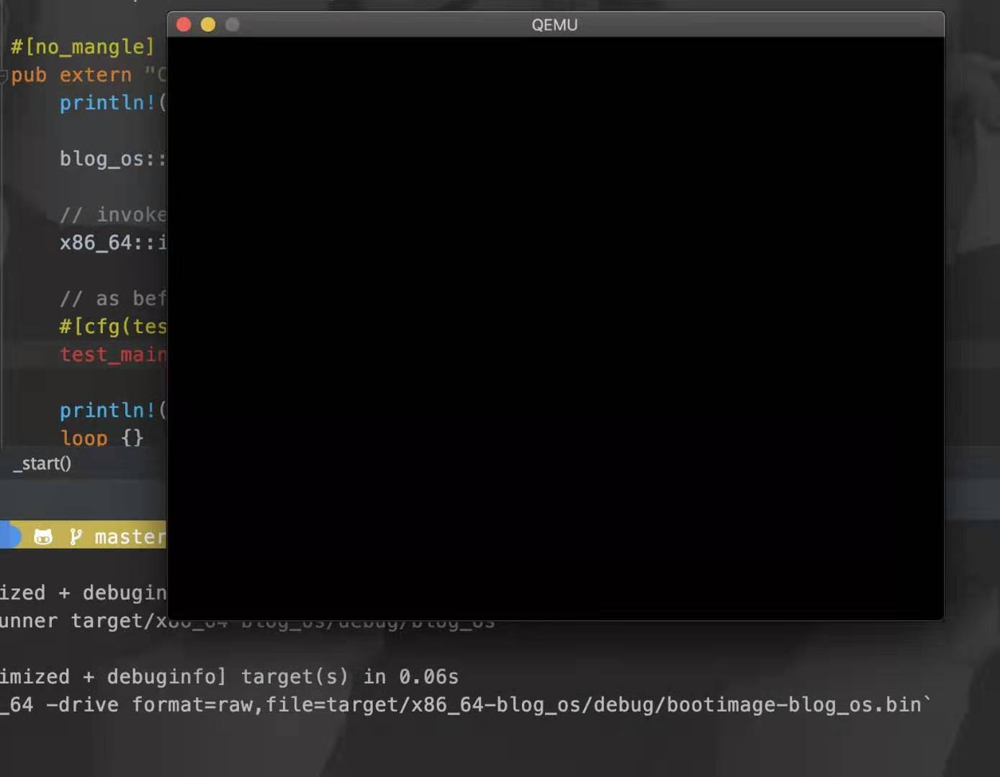
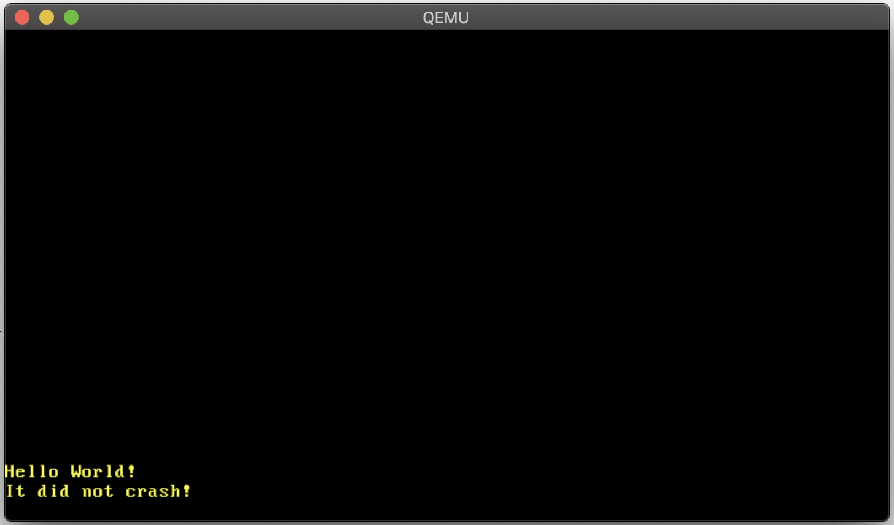

最近在学习 Rust，并且在尝试使用 Rust 来做内核，跟着 [Writing an OS in Rust](https://os.phil-opp.com/){:target="_blank"} 系列博客学习，这个博客质量非常高，深入浅出。

但是最近遇到一个qemu的问题,当我将系统升级到最近的 macOS 10.15 Catalina 之后，qemu 无法运行，启动之后卡死。如下：
{:height="360px" width="450px"}


### 解决方案

实际上卡死的原因是 Catalina 操作系统底层 API 变化导致的死锁。该死锁会导致 qemu 的 UI Cocoa 无法正常工作。

所以我们目前运行 qemu 的非 GUI 模式是正常的。

后来我在 qemu 的论坛发现有人报告这个 bug，并且有人已经修复了这个问题，但是还没有 release。但是也有人给出了其他解决方案，可以通过自己编译切换 UI 来解决这个问题。

##### 步骤如下（我使用homebrew安装，其他安装方式也一样，重新编译就行：

1. `brew edit qemu`
2. 添加依赖：sdl2，`depends_on "sdl2"`
3. 关闭 cocoa，将`--enable-cocoa` 改为 `--disable-cocoa`
4. 打开 sdl，将`--disable-sdl` 改为 `--enable-sdl`
5. `brew reinstall --build-from-source qemu`

最终的 Formula 文件：

```ruby
class Qemu < Formula
  desc "x86 and PowerPC Emulator"
  homepage "https://www.qemu.org/"
  url "https://download.qemu.org/qemu-4.1.0.tar.xz"
  sha256 "656e60218689bdeec69903087fd7582d5d3e72238d02f4481d8dc6d79fd909c6"
  head "https://git.qemu.org/git/qemu.git"

  bottle do
    sha256 "b8e20707ff317f4182fbd180f033f4a9f163e40fec54a442d9b227e2f39846db" => :catalina
    sha256 "3b35079b1729b9b1bd58087794ccd9d40848b69d22a601c12b451791709298d6" => :mojave
    sha256 "0ef458cc2c387f8bbb2bdbd0e4d6e2a21574eb735c1621ad8e0cd3e094288298" => :high_sierra
    sha256 "68d05c70584e722c8109682ddc041a6271e0c36d102c7d3f55553ba3b4f39480" => :sierra
  end

  depends_on "libtool" => :build
  depends_on "pkg-config" => :build
  depends_on "glib"
  depends_on "gnutls"
  depends_on "jpeg"
  depends_on "libpng"
  depends_on "libssh"
  depends_on "libusb"
  depends_on "lzo"
  depends_on "ncurses"
  depends_on "pixman"
  depends_on "vde"
  depends_on "sdl2"

  # 820KB floppy disk image file of FreeDOS 1.2, used to test QEMU
  resource "test-image" do
    url "https://dl.bintray.com/homebrew/mirror/FD12FLOPPY.zip"
    sha256 "81237c7b42dc0ffc8b32a2f5734e3480a3f9a470c50c14a9c4576a2561a35807"
  end

  def install
    ENV["LIBTOOL"] = "glibtool"

    args = %W[
      --prefix=#{prefix}
      --cc=#{ENV.cc}
      --host-cc=#{ENV.cc}
      --disable-bsd-user
      --disable-guest-agent
      --enable-curses
      --enable-libssh
      --enable-vde
      --extra-cflags=-DNCURSES_WIDECHAR=1
      --disable-cocoa
      --enable-sdl
      --disable-gtk
    ]
    # Sharing Samba directories in QEMU requires the samba.org smbd which is
    # incompatible with the macOS-provided version. This will lead to
    # silent runtime failures, so we set it to a Homebrew path in order to
    # obtain sensible runtime errors. This will also be compatible with
    # Samba installations from external taps.
    args << "--smbd=#{HOMEBREW_PREFIX}/sbin/samba-dot-org-smbd"

    system "./configure", *args
    system "make", "V=1", "install"
  end

  test do
    expected = build.stable? ? version.to_s : "QEMU Project"
    assert_match expected, shell_output("#{bin}/qemu-system-i386 --version")
    resource("test-image").stage testpath
    assert_match "file format: raw", shell_output("#{bin}/qemu-img info FLOPPY.img")
  end
end
```

重新编译安装之后，就不会出现死锁能正常工作了。

{:height="360px" width="450px"}

---

### 参考链接

1. [qemu 论坛关于 Catalina 无法运行的 bug 报告](https://bugs.launchpad.net/qemu/+bug/1847906){:target="_blank"}.
2. [github 修复改 bug 的 commit](https://github.com/qemu/qemu/commit/dff742ad27efa474ec04accdbf422c9acfd3e30e){:target="_blank"}.