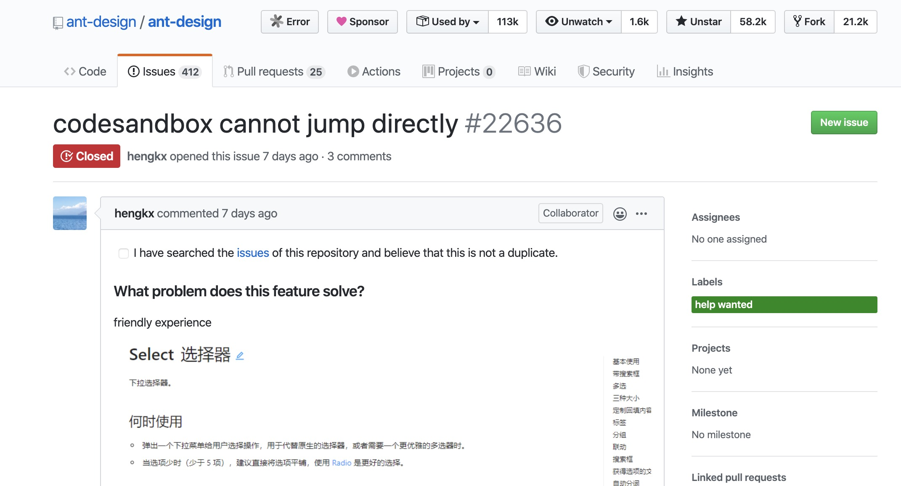
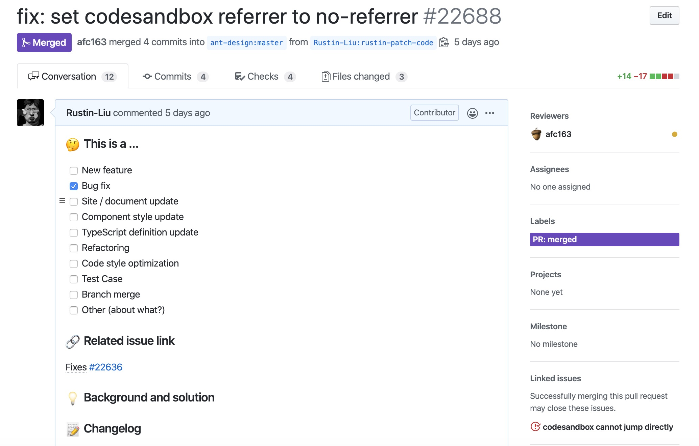
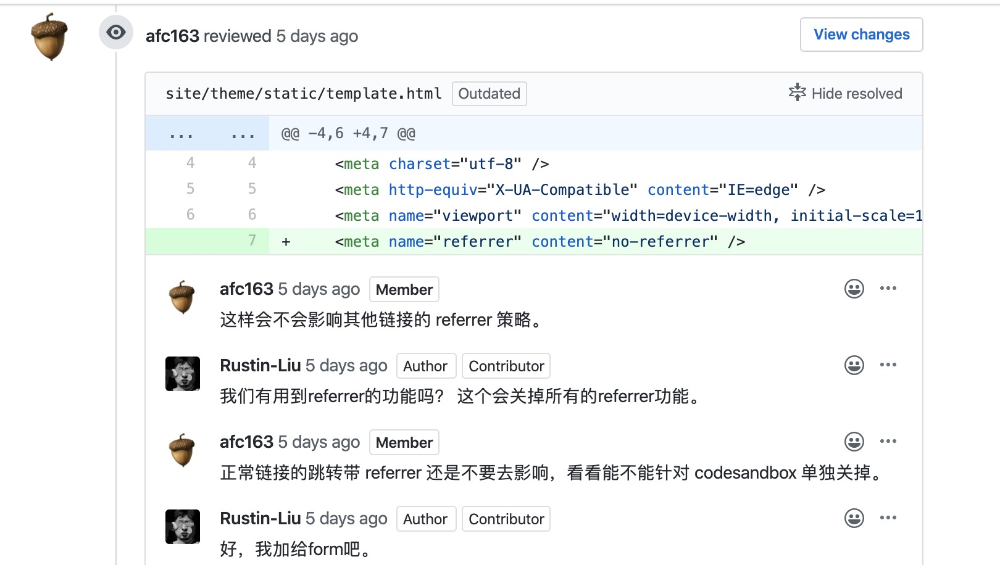
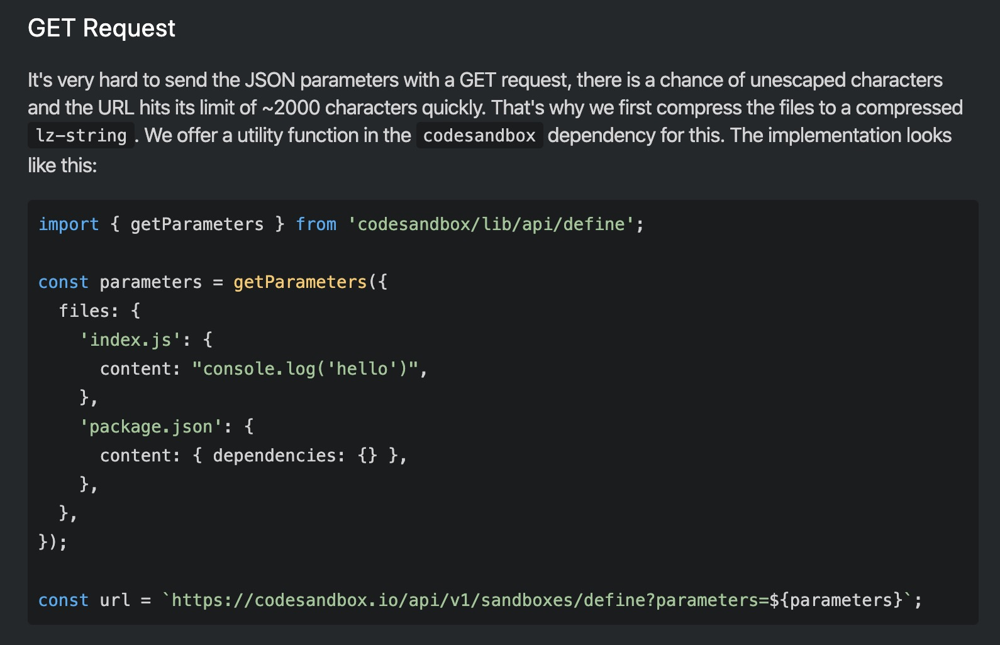

大家好，我是 Rustin。今天想跟大家介绍下如何快速的成为 antd 的贡献者，希望能够对想要加入 antd 社区贡献的同学有帮助！

此博客在 [GitHub](https://github.com/hi-rustin/blog) 上公开发布. 如果您有任何问题或疑问，请在此处打开一个 [issue](https://github.com/hi-rustin/blog/issues)。

## 简介

其实 [antd](https://github.com/ant-design/ant-design/) 几乎不需要做任何的介绍，大家都知道它是中国甚至世界都炙手可热的 UI 设计框架。他们的口号是：**企业级产品设计体系，创造高效愉悦的工作体验。**

我对这个框架感情颇深，从大二开始接触到这个框架至今已经陪我走过了 3 个年头，在校和实习期间用它愉悦的完成了数不清的作业和任务。去年在毕业设计期间，[终于为它贡献了第一份力量](https://github.com/ant-design/ant-design/pull/16398)。

最近我还在为它持续贡献力量，所以萌生了写一篇有关如何给 antd 贡献的文章的念头。言归正传，下面我会用我前两天帮 antd 修复一个 Bug 的例子来带大家熟悉一下在 antd 社区贡献的简单流程。

## 熟悉 PR 流程，阅读贡献指南

在我开始介绍我的例子之前，我觉得如果你刚开始尝试在 Github 的社区开始贡献，建议你读一下 [Github 官方的文档](https://help.github.com/cn/github/collaborating-with-issues-and-pull-requests/about-pull-requests)。

官方的文档介绍了一些很基础但是很重要的关于 PR 的规则，当你熟悉如何在 Github 创建一个 PR 之后，你还应该在 [antd](https://github.com/ant-design/ant-design) 的 README 中找到贡献指南，README 是每个开源项目很重要的入口，
你基本上在 README 中可以找到所有与该库相关的链接。

对于 antd 来说，他们把自己贡献指南挂在自己的官网当中，既有[中文版](https://ant.design/docs/react/contributing-cn)也有[英文版](https://ant.design/docs/react/contributing)。你可按照自己的情况仔细阅读完贡献指南。
我觉得目前我们可以从贡献指南获取的要点信息是：
- [开发准则](https://github.com/ant-design/ant-design/blob/master/CODE_OF_CONDUCT.md)
    - 对于开发准则来说，最主要的我觉得就是要保持尊重和礼貌，无论是对贡献者还是社区协作者，我们都应该保持绝对的尊重和礼貌。
    - 一个要点就是在和社区交流的时候多用：please, could, thanks，这在哪个社区都适用。
- **分支管理**
    - 这个是一个很重要的点，因为每个项目可能都有自己的开发和发布流程，在 antd 我们要注意的是：**修复 Bug 需要将 PR 发送到 master 分支，添加新功能则需要将 PR 发送到 feature 分支。**

- 提交 Bug 报告
    - 其实在开源社区提交 Bug 报告也是开源很重要的一环，所以大家不要觉得只有提 PR 才算贡献，其实只要是能促进代码库变得更好的事情在我看来都是贡献。
    - 需要注意的是，我们在给 antd 提交 issue 报告时不能直接去仓库的 issue 位置开启一个报告，我们需要在 antd 的 [issue 小助手](https://new-issue.ant.design/) 上面提交问题，
    为什么我们需要这样做呢？因为大型的开源项目，可能都会收到上百成千的 issue，但是这些 issue 提的风格迥异，会对社区协作者造成很大的困扰，用户和社区互相折磨。
    - 关于如何创建一个好的 Bug 的报告，可以看看这两篇文章：[How-To-Ask-Questions-The-Smart-Way](https://github.com/ryanhanwu/How-To-Ask-Questions-The-Smart-Way) 和 [如何有效地报告 Bug](https://www.chiark.greenend.org.uk/~sgtatham/bugs-cn.html)。
    
基本上我们得到这些要素信息之后，我们就可以开始尝试去给社区做一些简单的贡献，下面我就通过一个例子给大家演示下一个 PR 的合并过程。

## 挑选问题，开始挑战

我们的 PR 一般都是去修复 Bug 或者去添加一个新的功能，当我们刚开始参与一个开源项目的时候，我们可以从 Good First Issue 开始，大多数的开源项目都会给一些简单的问题加上 `good first issue` 的标签，
antd 就有这样被[标记的问题](https://github.com/ant-design/ant-design/issues?q=is%3Aissue+is%3Aopen+label%3A%22good+first+issue%22)，但是一般的活跃社区这样的问题都比较抢手，
可能问题刚发出来就被别人领取之后开始修复了，但是除了这些问题之外，在 antd 还有一类问题我觉得难度适中，可以作为一些入门的问题来尝试。

在 antd 的 issue 中，有一类问题被 `help wanted` 的标签标记，这些问题大多都是一些用户提的需求或者简单的 Bug，我们可以从这些问题入手，比如我上周六在 issue 列表中，发现了[这个 help wanted 的问题](https://github.com/ant-design/ant-design/issues/22636)。

{:height="550px" width="750px"}


我看到这个问题的时候，报告人已经做了一些研究，似乎是 referer HTTP 头信息造成的。一般在开源社区中，如果你想修复这个问题，你就可以在下方留言自己已经在尝试修复这个问题或者 @ 社区协作者
询问看你能不能尝试修复这个问题。因为我没看到别人的留言，我就开始了一些尝试去修复这个问题。

## 尝试修复，提交 PR

首先，我没有在自己的网站或者公司的网站中使用过 codesandbox，所以集成 codesandbox 对我来说是个陌生的事情。
但是能够发现问题报告人似乎已经做出了研究，那我能不能顺着提问者的思路去解决这个问题呢？

关于 [referer](https://developer.mozilla.org/zh-CN/docs/Web/HTTP/Headers/Referer) 你可以查阅它的一些标准，你会发现它还有个历史遗留问题。referer 实际上是 "referrer" 误拼写。
看完之后我还看到了[阮一峰老师的博客](http://www.ruanyifeng.com/blog/2019/06/http-referer.html)，但是实际上文章中有点小错误，我已经留言了，可能阮一峰老师还没来得及看。

关于 referer 的相关信息我就不再赘述，可以查看上面的链接文章。当时我想能不能就简单暴力的设置 `<meta name="referrer" content="no-referrer">` 来解决呢？它表示我们对于任何请求都不带 referrer 信息。我在本地测试发现确实有效。

因为我觉得也许这个功能对于 antd 来说本身没有什么影响，所以我就提交了[这份代码](https://github.com/ant-design/ant-design/pull/22688/commits/fa3b1c66b33b3bc0c5f8eb1b267317114d05dd48)。
在 antd 中提交 PR，跟提交问题报告一样也需要遵循一份 PR 的提交模板，这份模板是放在 [.github 目录下的](https://github.com/ant-design/ant-design/blob/master/.github/PULL_REQUEST_TEMPLATE.md),
它也有[中文版](https://github.com/ant-design/ant-design/blob/master/.github/PULL_REQUEST_TEMPLATE/pr_cn.md)，所以我就不再描述里面的内容，因为我觉得还是比较清晰的。 
我的 PR 是修复 Bug，所以根据我们从贡献指南中获取到的信息来说，我们应该创建一个 PR 到 master 分支并填好 PR 的[相关信息](https://github.com/ant-design/ant-design/pull/22688)：

{:height="550px" width="800px"}

到这里，似乎大功告成，坐等 PR 被合并了(我在 PR 的信息中使用了 Github 关联 PR 和 issue 的功能 "Fixes #22636"，[查看用法](https://help.github.com/cn/github/managing-your-work-on-github/linking-a-pull-request-to-an-issue))。

## 收到建议，重新修改

但是实际上没有那么顺利，一般我们在提交 PR 之后，大概率会收到社区协作者的 code review，在 antd 中，会有🤖来帮你分配 reviewer。我的 PR 被 afc163 大神 review 了，收到了如下的评论：

{:height="450px" width="750px"}

在和 afc163 交流之后，我们确定需要只对 codesandbox 做特殊的处理，所以我就开始了一次新的尝试。

首先，从思路上来说，目前想要做这种特殊的处理，我们只能对使用特殊的标签来处理这种情况，具体支持单独设置 referer 的标签可以查阅这个[文档](https://developer.mozilla.org/zh-CN/docs/Web/HTTP/Headers/Referrer-Policy)。
同时我还去查阅了 codesandbox 的官方文档，我发现他们提供的[定义接口](https://codesandbox.io/docs/importing#define-api)其实不光支持 post 请求，同时还支持 get 请求:

{:height="450px" width="750px"}

那我立刻有了思路，我可以直接使用 `<a>` 标签来发送 get 请求解决这个问题，我立刻修改代码发送了 get 请求并且设置了 referer 规则：
```jsx
<form>
    <Tooltip title={<FormattedMessage id="app.demo.codesandbox" />}>
       {/* FIXME: This temporarily solution to fix issues/22636, we need revert it to use form after the codesandbox api issue fixed. */}
            <a
              aria-label="Create New Sandbox with Prefilled Data" // {/* 这个属性详见 https://developer.mozilla.org/en-US/docs/Web/Accessibility/ARIA*/}
              rel="noopener noreferrer" // {/* 设置不带 referrer 信息 */}
              target="_blank"
              href={`https://codesandbox.io/api/v1/sandboxes/define?parameters=${compress(
              JSON.stringify(codesanboxPrefillConfig),
              )}`} {/* 生成参数 */}
              className="code-box-codesandbox"
              onClick={() => this.track({ type: 'codesandbox', demo: meta.id })}
             />
    </Tooltip>
</form>
```

我提交这段代码，然后顺利的通过了 afc163 的 review，然后代码就可以顺利的合进了 master 分支了，我们关联的问题 Github 也会自动的关闭。

但是这样确实就真的解决问题了吗？但是我到这一步还是没能找到问题所在，为什么会像问题里面说的突然这几天就出问题呢？

## 排查问题，继续跟踪

我好奇的是为什么这个东西会突然出问题呢？然后我就去翻了 master 分支的提交记录，发现并没有最近的跟它相关的提交修改记录，所以我就去了 codesandbox 官方文档又看了看，然后找到了一个他们官方的 [demo](https://codesandbox.io/s/define-api-post-request-qzlp7nw34q?from-embed)。
我发现他们的 demo 也是需要重定向的，所以我觉得这应该不是 antd 的修改造成的问题。然后我又在官网上发现了他们的 [codesandbox-client](https://github.com/codesandbox/codesandbox-client) 开源仓库。

找到三方依赖的仓库，我们就可以提交一个 issue 去让他们帮忙查查看，另外也可以看看别人有没有这个问题，所以我创建了这个 [issue](https://github.com/codesandbox/codesandbox-client/issues/3769) 来继续跟踪这个问题。

终于在三天之后，我收到了该社区的回复，我们发现其他人也有和 antd [类似的问题](https://github.com/codesandbox/codesandbox-client/issues/3769#issuecomment-606660384)。该社区的协作者迅速的修复了这个问题。
他们解释说这是他们最近后端的一个[跨域修改](https://github.com/codesandbox/codesandbox-client/issues/3769#issuecomment-606674734)造成的，但是没有说明具体的细节，然后迅速的解决了这个问题。

## 回滚代码，解决问题

当 codesandbox 的问题修复之后，我也按照上面的流程再次发起了一个 PR 去回滚了我的代码，因为可以看到我在上面的代码中加入了一个 FIXME，我的那种修改只是一种暂时的解决方案，因为我的修改方案会与其他几个三方的链接模式不一致，
所以我在这个 [PR](https://github.com/ant-design/ant-design/pull/22797) 中回滚了代码。

到此为止，我们就真正意义上的解决了这个问题，我们也完整的走完了一个给 antd 贡献的流程。希望我的这篇记录能对你尝试在 antd 社区贡献有帮助！

此外我还在 antd 开了个跟[骨架屏](https://github.com/ant-design/ant-design/issues/20574)相关的坑，欢迎大家来 antd 一起填坑！

---

### 参考链接
[antd contributing guide](https://ant.design/docs/react/contributing)

[rust contributing guide](https://github.com/rust-lang/rust/blob/master/CONTRIBUTING.md)

[github docs](https://help.github.com/)

### 文章链接

文章首发于： [Rustin 的博客](https://hi-rustin.rs/)

同步更新：

[知乎](https://zhuanlan.zhihu.com/p/123367842)
  
[简书](https://www.jianshu.com/p/77471d5d4afb)
    
[掘金](https://juejin.im/post/5e872cf3f265da480836a8e7)
    
[segmentfault](https://segmentfault.com/a/1190000022259063)