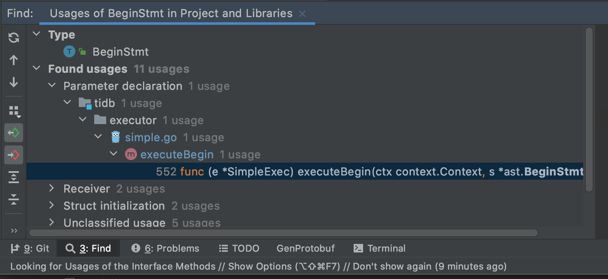

大家好，我是 [Rustin](https://github.com/Rustin-Liu). 最近开始做贵司推出的 TiDB High Performance 课程，所以开个课程实验记录的坑！

此博客在 [GitHub](https://github.com/Rustin-Liu/blog) 上公开发布. 如果您有任何问题或疑问，请在此处打开一个 [issue](https://github.com/Rustin-Liu/blog/issues).

## 简介

在高性能挑战赛的 [文档](https://docs.qq.com/sheet/DSlBwS3VCb01kTnZw?tab=BB08J2) 中找到第一节课的实验描述，实验需要分别下载和编译 TiDB, TiKV 和 PD，
并且需要修改 TiDB 源码让其在启动事务的时候，打印一句 `hello transation` 的日志。下面我就简单记录一下整个实验过程。

## 克隆源码并编译

需要分别克隆和编译 [TiDB](https://github.com/pingcap/tidb), [TiKV](https://github.com/tikv/tikv) 和 [PD](https://github.com/tikv/pd).
这三个库分别对应了 TiDB 中的计算，存储和调度三个层面。具体内容可以参考课程文档中对应的三篇文章。

### 编译 TiDB

```sh
git clone https://github.com/Rustin-Liu/tidb
```
在编译之前，需要我们安装 **make** 工具，因为三个项目的 build 都是用 makefile 来组织的。查看 makefile 可以看到 `.PHONY` 中有个 server
的伪目标。内容如下：

```makefile
server:
ifeq ($(TARGET), "")
	CGO_ENABLED=1 $(GOBUILD) $(RACE_FLAG) -ldflags '$(LDFLAGS) $(CHECK_FLAG)' -o bin/tidb-server tidb-server/main.go
else
	CGO_ENABLED=1 $(GOBUILD) $(RACE_FLAG) -ldflags '$(LDFLAGS) $(CHECK_FLAG)' -o '$(TARGET)' tidb-server/main.go
endif
```

可以看到这就是编译 TiDB server 的命令，该命令会把 server 编译到 bin 目录下。但是实际上在 TiDB 的伪目标中原来还有个 build 的命令，
它是个无用的命令，没有地方用到了这个命令。所以我就提交了个 [PR](https://github.com/pingcap/tidb/pull/19221) 把它删除了。运行使用 `make server` 即可。

```
make server
```

在编译完成后，bin 目录如下所示：
```sh
➜  bin git:(master) ✗ tree
.
└── tidb-server

0 directories, 1 file
```

### 编译 TiKV

```sh
git clone https://github.com/Rustin-Liu/tikv
```

在编译之前我也是需要安装好 build TiKV 项目工具链，可以在 [CONTRIBUTING](https://github.com/tikv/tikv/blob/master/CONTRIBUTING.md) 里面找到一些需要的依赖。
主要就是再装一个 **cmake**，安装完成之后我们就可以进行 TiKV 的编译了。查看 makefile 找到编译命令如下：

```
build:
	cargo build --no-default-features --features "${ENABLE_FEATURES}"
```

TiKV 这边的比较直观，就是叫 build。实际上就是运行 [cargo](https://github.com/rust-lang/cargo) 的 build 命令。运行 `make build`.

```
make build
```

cargo 编译完的二进制文件在 target 中，目录如下所示：

```sh
➜  debug git:(master) ls
build            incremental      tikv-ctl         tikv-server
deps             libcmd.d         tikv-ctl.d       tikv-server.d
examples         libcmd.rlib      tikv-ctl.dSYM    tikv-server.dSYM
```

可以找到名字为 `tikv-server` 的二进制文件。

### 编译 PD

```sh
git clone https://github.com/Rustin-Liu/pd
```

PD 中也没有特殊的编译工具链要求，直接使用查看 makefile 找到编译的命令：

```sh
build: pd-server pd-ctl pd-recover

pd-server: export GO111MODULE=on
pd-server: ${PD_SERVER_DEP}
	CGO_ENABLED=$(BUILD_CGO_ENABLED) go build $(BUILD_FLAGS) -gcflags '$(GCFLAGS)' -ldflags '$(LDFLAGS)' -tags "$(BUILD_TAGS)" -o bin/pd-server cmd/pd-server/main.go
```

运行 `make build` 得到如下的目录：

```sh
➜  bin git:(master) tree
.
├── pd-ctl
├── pd-recover
└── pd-server
```

## 使用 TiUP 部署本地集群

可以尝试使用 [tiup](https://tiup.io/) 来部署本地集群测试。TiUP 是贵司在 TiDB 4.0 时研发的一个新的部署工具，据说是受到 [rustup](https://rustup.rs/) 的启发做的。
利用 TiUP 使用自己编译的二进制文件即可快速的部署一套本地的集群测试。但是似乎 TiUP 官网的文档链接主要是针服务器上的部署，但是可以在 [TiDB in action](https://book.tidb.io/session2/chapter1/tiup-playground.html)
的 TiUP 部署本地测试环境章节中找到通过指定二进制文件路径来启动本地集群的参数。

参数如下所示：

```sh
Usage:
  tiup playground [version] [flags]

Flags:
      --db.binpath string   TiDB instance binary path
      --kv.binpath string   TiKV instance binary path
      --pd.binpath string   PD instance binary path
```

通过这三个参数，可以快速的利用 TiUP 使用自己编译的二进制文件启动本地集群。使用如下命令启动集群：

```sh
➜  ~ tiup playground --db.binpath /Users/rustin/GolandProjects/tidb/bin/tidb-server --kv.binpath /Users/rustin/ClionProjects/tikv/target/debug/tikv-server --pd.binpath /Users/rustin/GolandProjects/pd/bin/pd-server
```

输出以下内容之后启动成功：

```sh
CLUSTER START SUCCESSFULLY, Enjoy it ^-^
To connect TiDB: mysql --host 127.0.0.1 --port 4000 -u root
To view the dashboard: http://127.0.0.1:2379/dashboard
To view the Prometheus: http://127.0.0.1:9090
To view the Grafana: http://127.0.0.1:3000
```

启动成功后使用 mysql 客户端连接成功：

```sh
➜  ~ mysql --host 127.0.0.1 --port 4000 -u root
Welcome to the MySQL monitor.  Commands end with ; or \g.
Your MySQL connection id is 2
Server version: 5.7.25-TiDB-v4.0.0-beta.2-1101-gf82e5320a-dirty TiDB Server (Apache License 2.0) Community Edition, MySQL 5.7 compatible

Copyright (c) 2000, 2020, Oracle and/or its affiliates. All rights reserved.

Oracle is a registered trademark of Oracle Corporation and/or its
affiliates. Other names may be trademarks of their respective
owners.

Type 'help;' or '\h' for help. Type '\c' to clear the current input statement.

mysql> use test;
Database changed
```

## 输出 `hello transation`

### 输出到 `warnings`

原来的题目描述中其实并没有要求输出到日志中，所以我想要不直接输出到 `warnings` 中。为了找到与事务开始的相关的代码，我先去 ast 包中搜索 begin 关键字找到了 begin 语句的定义。
然后通过 `GoLand` 搜索引用，找到了相关的引用：



通过引用找到了执行 begin 语句的函数，它被定义在 `simple.go` 中。尝试直接添加输出到 warnings：

```go
// FILE: tidb/executor/simple.go

func (e *SimpleExec) executeBegin(ctx context.Context, s *ast.BeginStmt) error {
	// ...

	e.ctx.GetSessionVars().StmtCtx.AppendNote(errors.New("hello transaction"))

	// ...
}
```

从当前执行器中获取语句 Context 然后在其中追加一句 Note，这样就可以在 begin 语句执行之后，在 warnings 中找到这个 Note.
启动集群尝试执行一个事务：

```sh
➜  ~ mysql --host 127.0.0.1 --port 4000 -u root

mysql> use test;
Database changed
mysql> begin;
Query OK, 0 rows affected, 1 warning (0.00 sec)

mysql> show warnings;
+-------+------+-------------------+
| Level | Code | Message           |
+-------+------+-------------------+
| Note  | 1105 | hello transaction |
+-------+------+-------------------+
1 row in set (0.00 sec)
```

这样我们就实现了在事务 begin 语句执行后输出一句 `hello transation`.

### 输出到日志

后来题目改了要求，需要将 `hell transation` 输出到日志当中。输出到日志当中也十分简单，可以同样在 `simple.go` 的 **executeRollback** 
找到如何打印日志的例子：

```go
// FILE: tidb/executor/simple.go

func (e *SimpleExec) executeRollback(s *ast.RollbackStmt) error {
	// ...

	logutil.BgLogger().Debug("execute rollback statement", zap.Uint64("conn", sessVars.ConnectionID))
	
    // ...
}
```

我们也可以在 **executeBegin** 中尝试添加日志：

```go
// FILE: tidb/executor/simple.go

func (e *SimpleExec) executeBegin(ctx context.Context, s *ast.BeginStmt) error {
	// ...

	logutil.BgLogger().Info("hello transaction")

	// ...
}
```

再次提交事务测试后，可以去 `.tiup` 目录中找到该日志：

```sh
➜  tidb-0 pwd
/Users/rustin/.tiup/data/SA3l5r6/tidb-0
➜  tidb-0 less tidb.log
# 搜索 hello 找到日志
[2020/09/09 11:51:23.426 +08:00] [INFO] [simple.go:584] ["hello transaction"]
```

这样就输出了 `hello transaction` 到日志中。

到这基本上就算是完成了实验，**但是整个实验中忽略了自动提交的情况**。目前最大的收获是学会了用 `TiUP` 快速的部署和搭建本地的测试环境。

### 参考链接

[三篇文章了解 TiDB 技术内幕 - 说存储](https://pingcap.com/blog-cn/tidb-internal-1/)

[三篇文章了解 TiDB 技术内幕 - 说计算](https://pingcap.com/blog-cn/tidb-internal-2/)

[三篇文章了解 TiDB 技术内幕 - 谈调度](https://pingcap.com/blog-cn/tidb-internal-3/)

[TiDB In Action: based on 4.0](https://book.tidb.io/)

### 文章链接

文章首发于： [Rustin 的博客](https://rustin.cn/)

同步更新：

[知乎]()
  
[简书]()
    
[掘金]()
    
[segmentfault]()