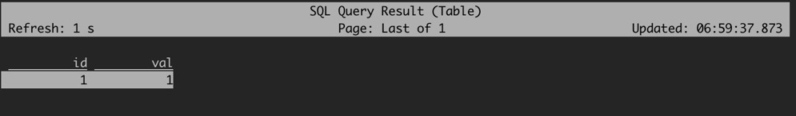

> 免责声明：我既不懂 TiCDC，也不懂 Flink。所以下面的文章很有可能是一派胡言。

最近我在帮 [TiCDC] 的 [Kafka Sink] 做多 Topic 支持，目标是让 TiCDC 能够把 [TiDB] 的数据接入到 [Flink]。其实现在的 TiCDC 就具备接入 Flink 的能力，只是受限于目前的 Kafka Sink
只能支持单个 Topic，接入和维护非常麻烦。

我来介绍一下目前 TiCDC 接入 Flink 的现状和方法。

此博客在 [GitHub](https://github.com/hi-rustin/blog) 上公开发布.
如果您有任何问题或疑问，请在此处打开一个 [issue](https://github.com/hi-rustin/blog/issues).

## 简介

TiCDC Kafka Sink 支持多种协议格式，其中活跃维护的是 TiCDC 自己实现的 `open-protocol` 和阿里巴巴的 `canal-json` 协议。这次我们需要使用 `canal-json` 协议并通过 Flink
的 [Kafka connector] 接入 Flink 系统。

## 启动 TiDB 和 TiCDC 集群

推荐使用 TiUP 启动 TiDB 和 TiCDC 集群，因为今天只是简单演示所以我就用 TiUP 的 Playground 启动测试集群。

使用以下命令启动集群：

```shell
tiup playground nightly --ticdc 1
```

这个命令首先会启动一个 TiDB playground 集群，其次因为我们指定了 `--ticdc 1` 所以它也会在集群中启动一个 TiCDC Server。

如果你在使用这个命令的过程中遇到了类似如下的错误：

```shell
Error: Playground bootstrapping failed: version v5.4.0-nightly-20211225 on darwin/amd64 for component prometheus not found: unknown version
```

你可以尝试使用 `tiup update playground` 命令更新你的 Playground 组件之后再启动。启动完成之后控制台会输出：

```shell
CLUSTER START SUCCESSFULLY, Enjoy it ^-^
To connect TiDB: mysql --comments --host 127.0.0.1 --port 62505 -u root -p (no password)
To view the dashboard: http://127.0.0.1:2379/dashboard
PD client endpoints: [127.0.0.1:2379]
To view the Prometheus: http://127.0.0.1:9090
To view the Grafana: http://127.0.0.1:3000
```

现在我们就可以用 MySQL 客户端连接 TiDB 集群并查看版本：

```shell
mysql --comments --host 127.0.0.1 --port 62505 -u root -p

mysql> SELECT tidb_version();
+-----------------------------------------------------------------------------------------------------------------------+
| tidb_version()                                                                                                                                                                                                                                                                                                                   |
+-----------------------------------------------------------------------------------------------------------------------+
| Release Version: v5.5.0-alpha
Edition: Community
Git Commit Hash: 23f7e51ae01287fa7f811e1462d8987e4d7727a4
Git Branch: heads/refs/tags/v5.5.0-alpha
UTC Build Time: 2022-01-27 14:58:42
GoVersion: go1.16.4
Race Enabled: false
TiKV Min Version: v3.0.0-60965b006877ca7234adaced7890d7b029ed1306
Check Table Before Drop: false |
+-----------------------------------------------------------------------------------------------------------------------+
1 row in set (0.00 sec)
```

可以看到我们启动了一个 nightly 版本的 TiDB 集群，我们使用 nightly 是因为过去几个月 TiCDC 团队对 `canal-json` 协议进行了大量的测试和问题修复，所以更推荐使用最新版本 TiCDC
的 `canal-json` 实现。 这些修复也将在 v5.4.0 发布。

说到 v5.4.0 ，可能大家可以看到一个奇怪的现象，上面的版本都到 v5.5.0 了，但是 v5.4.0 还没发布。这跟 TiDB 社区目前的发布和分支维护模型有关。因为我们现在已经切出了 v5.4 分支开始了发布前的测试，所以现在
master 上的 nightly 就只能用 v5.5.0-alpha 的版本标签了。

## 启动 Kafka 和 Flink 集群

在本地直接启动 Kafka 和 Flink 集群比较繁琐且坑比较多，所以我们可以使用 docker 和 docker-compose 快速的启动 Kafka 和 Flink 集群。

我整理出了我在测试 Flink 时用到的 docker-compose，并将它分享到了 GitHub。我们这次使用的是 Kafka connector 如果直接使用 Flink 的官方镜像，你在执行 SQL 的时候就会遇到
ClassNotFound 的 Java 异常，并且手动下载这些 Jar 包并重启 Flink 会比较麻烦，所以我自定义了一个 Dockerfile 来提前下载这些 Jar 包。

```Dockerfile
FROM flink:scala_2.11-java11
RUN wget -P /opt/flink/lib/ https://repo1.maven.org/maven2/org/apache/kafka/kafka-clients/2.8.1/kafka-clients-2.8.1.jar
RUN wget -P /opt/flink/lib/ https://repo1.maven.org/maven2/org/apache/flink/flink-connector-kafka_2.11/1.14.2/flink-connector-kafka_2.11-1.14.2.jar
```

我们在原镜像的基础上，下载了 Kafka 的客户端包和 Flink 连接器的包。docker-compose 文件就不展开讲了，都是一些最基本的配置。

我们克隆该仓库之后在根目录通过一条命令就可以启动一个 Kafka 和 Flink 集群。

```shell
git clone https://github.com/hi-rustin/ticdc-test-compose
cd ticdc-test-compose
docker-compose -f ./docker-compose-flink.yaml up -d
```

启动完成之后 `docker ps`:

```shell
➜  ~ docker ps
CONTAINER ID   IMAGE                            COMMAND                  CREATED          STATUS          PORTS                                  NAMES
54ccfdccb655   ticdc-test-compose_taskmanager   "/docker-entrypoint.…"   43 seconds ago   Up 33 seconds   6123/tcp, 8081/tcp                     ticdc-test-compose-taskmanager-1
9fb8830ff91b   ticdc-test-compose_jobmanager    "/docker-entrypoint.…"   44 seconds ago   Up 36 seconds   6123/tcp, 0.0.0.0:8081->8081/tcp       ticdc-test-compose-jobmanager-1
d89734157871   wurstmeister/kafka               "kafka-console-consu…"   44 seconds ago   Up 36 seconds                                          ticdc-test-compose-kafka-consumer-1
10b933f61756   wurstmeister/kafka               "start-kafka.sh"         45 seconds ago   Up 38 seconds   0.0.0.0:9092->9092/tcp                 ticdc-test-compose-kafka-1
839efd64fe11   wurstmeister/zookeeper           "/bin/sh -c '/usr/sb…"   46 seconds ago   Up 41 seconds   22/tcp, 2181/tcp, 2888/tcp, 3888/tcp   ticdc-test-compose-zookeeper-1
```

可以看到我们启动了一个 Kafka 集群，其中包括一个 Server 和一个 Consumer，Server 会根据配置创建一个名为 `ticdc-test` 的 Topic，Consumer 也会在 console 中开始消费这个
Topic。 另外，我们也启动了 Flink 的 jobmanager 和 taskmanager。

## 创建 Changefeed 开始同步数据到 Kafka

当 TiDB、Kafka 和 Flink 集群都启动之后，我们就可以使用 TiCDC 的 cli 工具创建 changefeed 进行数据同步。使用如下命令创建 changefeed：

```shell
➜  ticdc-test-compose git:(main) tiup cdc:nightly cli changefeed create --sink-uri="kafka://localhost:9092/ticdc-test?protocol=canal-json"
The component `cdc` version v5.5.0-nightly-20220127 is not installed; downloading from repository.
component cdc version v5.5.0-nightly-20220127 is already installed
Starting component `cdc`: /Users/rustin/.tiup/components/cdc/v5.5.0-nightly-20220127/cdc cli changefeed create --sink-uri=kafka://localhost:9092/ticdc-test?protocol=canal-json
[2022/01/30 14:35:11.368 +08:00] [WARN] [kafka.go:383] ["topic's `max.message.bytes` less than the user set `max-message-bytes`,use topic's `max.message.bytes` to initialize the Kafka producer"] [max.message.bytes=3145728] [max-message-bytes=10485760]
[2022/01/30 14:35:11.368 +08:00] [WARN] [kafka.go:393] ["topic already exist, TiCDC will not create the topic"] [topic=ticdc-test] [detail="{\"NumPartitions\":1,\"ReplicationFactor\":1,\"ReplicaAssignment\":{\"0\":[1001]},\"ConfigEntries\":{\"max.message.bytes\":\"3145728\",\"segment.bytes\":\"1073741824\"}}"]
Create changefeed successfully!
ID: 040a4c2c-a829-42f6-b913-af9bb43c6ef4
Info: {"sink-uri":"kafka://localhost:9092/ticdc-test?protocol=canal-json","opts":{"max-message-bytes":"3145728"},"create-time":"2022-01-30T14:35:11.176117+08:00","start-ts":430840089420759041,"target-ts":0,"admin-job-type":0,"sort-engine":"unified","sort-dir":"","config":{"case-sensitive":true,"enable-old-value":true,"force-replicate":false,"check-gc-safe-point":true,"filter":{"rules":["*.*"],"ignore-txn-start-ts":null},"mounter":{"worker-num":16},"sink":{"dispatchers":null,"protocol":"canal-json","column-selectors":null},"cyclic-replication":{"enable":false,"replica-id":0,"filter-replica-ids":null,"id-buckets":0,"sync-ddl":false},"scheduler":{"type":"table-number","polling-time":-1},"consistent":{"level":"none","max-log-size":64,"flush-interval":1000,"storage":""}},"state":"normal","error":null,"sync-point-enabled":false,"sync-point-interval":600000000000,"creator-version":"v5.5.0-alpha"}
```

我们成功的创建了 changefeed，但是出现了两条警告，**第一条警告看起来比较诡异，因为我们并没有传递这个参数，我完了去报个 bug 修一修**。第二条警告是说我们的 Topic 已经存在了，所以不会再自动创建该 Topic。

在 changefeed 创建成功之后，我们就可以开始同步数据了。我们首先在 TiDB `test` 数据库中创建一个 `simple1` 表并插入数据：

```sql
use
test;
CREATE table test.simple1
(
    id  int primary key,
    val int
);
INSERT INTO test.simple1(id, val)
VALUES (1, 1);
```

这个时候数据已经写到 Kafka 了，我们使用 `docker logs ticdc-test-compose-kafka-consumer-1 -f ` 就可以看到 Kafka console Consumer 已经输出了这两条变更:

```console
Partition:0	{"id":0,"database":"test","table":"simple1","pkNames":null,"isDdl":true,"type":"CREATE","es":1643525212536,"ts":1643525215268,"sql":"CREATE TABLE `test`.`simple1` (`id` INT PRIMARY KEY,`val` INT)","sqlType":null,"mysqlType":null,"data":null,"old":null}
Partition:0	{"id":0,"database":"test","table":"simple1","pkNames":["id"],"isDdl":false,"type":"INSERT","es":1643525217386,"ts":1643525218526,"sql":"","sqlType":{"id":4,"val":4},"mysqlType":{"id":"int","val":"int"},"data":[{"id":"1","val":"1"}],"old":null}
```

## 使用 Flink SQL 建表查询

当数据写到 Kafka 之后，我们就可以启动 Flink SQL Client 进行建表和查询了。 首先我们需要进入 jobmanager 的容器内部：

```shell
docker exec -it ticdc-test-compose-jobmanager-1 bash
```

进入容器之后我们会在 flink 目录下，我们需要进入 bin 目录执行启动命令：

```shell
cd bin
./sql-client.sh embedded
```

如果你的环境设置正确，我们现在应该就进入了 Flink SQL Client 的环境看到了小松鼠。

接下来执行如下的建表 SQL:

```sql
CREATE TABLE topic_test
(
    id  int primary key,
    val int
) WITH (
      'connector' = 'kafka',
      'topic' = 'ticdc-test',
      'properties.bootstrap.servers' = 'kafka:9092',
      'properties.group.id' = 'testGroup',
      'scan.startup.mode' = 'earliest-offset',
      'format' = 'canal-json',
      'canal-json.ignore-parse-errors' = 'true'
      );
```

对于这条命令，我们需要关注 WITH 中的这些参数：

| 参数名                            | 说明                                                                 |
|--------------------------------|--------------------------------------------------------------------|
| connector                      | 指定我们使用 Kafka connector                                             |
| topic                          | 新建的这张表数据从 Kafka 的哪个 Topic 获取                                       |
| properties.bootstrap.servers   | Kafka Broker 的连接地址，因为我们在 docker-compose 用了 bridge 的网络，所以使用服务名加端口即可 |
| properties.group.id            | Kafka 消费组 ID                                                       |
| scan.startup.mode              | Kafka consumer 的启动模式，从可能的最早偏移量开始                                   |
| format                         | 使用 `canal-json` 协议解析消息                                             |
| canal-json.ignore-parse-errors | 忽略掉解析错误，这在跳过和忽略一些不支持的 DDL 和 DML 时很有用                               |

该命令执行成功之后我们就可以查询数据了：

```sql
select *
from topic_test;
```

{:height="100px" width="750px"}

可以看到我们前面插入的数据已经正确的被解析和查询到了。现在当你在上游插入或者删除数据时，它也会实时更新数据。

以上就是 TiCDC 将 TiDB 数据接入 Flink 的简单演示，但是目前由于 TiCDC 单个 changefeed 只支持同步到一个 Topic，所以在真实业务场景中可能需要创建大量的 changefeed
把每张表单独进行同步，然后在 Flink 再聚合使用。 目前 TiCDC 团队也正在实现单个 changefeed 的多 Topic 支持，希望我们能尽快的把它做完让用户更加方便的将数据接入 Flink。

### 参考链接

[Flink Docker Setup](https://nightlies.apache.org/flink/flink-docs-master/zh/docs/deployment/resource-providers/standalone/docker/)

[Flink Canal](https://nightlies.apache.org/flink/flink-docs-master/docs/connectors/table/formats/canal/)


[TiCDC]: https://docs.pingcap.com/tidb/stable/ticdc-overview/

[Kafka Sink]: https://docs.pingcap.com/tidb/stable/manage-ticdc#configure-sink-uri-with-kafka

[Kafka connector]: https://nightlies.apache.org/flink/flink-docs-release-1.14/docs/connectors/table/kafka/

[Flink]: https://flink.apache.org/

[TiDB]: https://docs.pingcap.com/tidb/stable/
